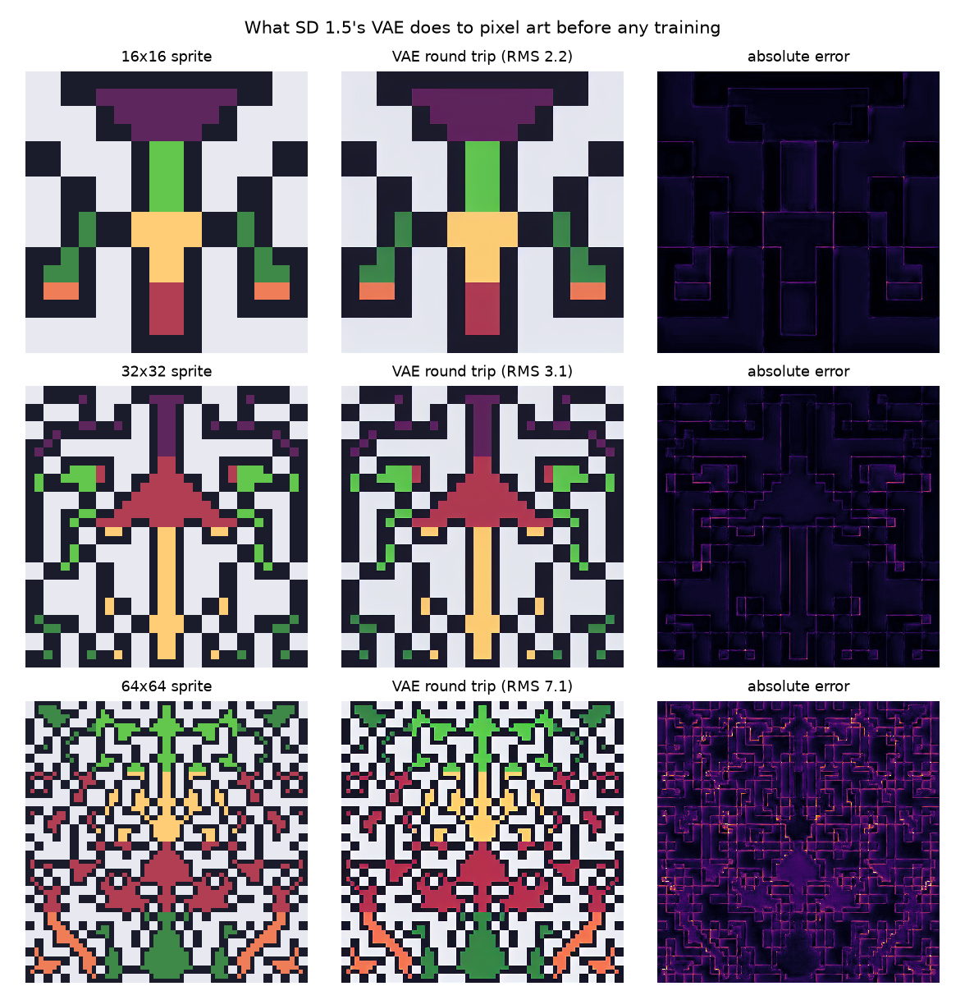

# pixel-art-lora

Fine-tuning Stable Diffusion 1.5 with LoRA to generate pixel art sprites, and measuring what the fine-tuning actually buys.

Stable Diffusion is built for smooth natural images. Pixel art is the opposite: hard edges, no anti-aliasing, a small fixed palette. The question is not whether the adapter makes sprites, but how close it gets, and how much of the final quality comes from the adapter versus from post-processing. Every number is computed, nothing is eyeballed.

## 1. The VAE reconstruction floor

SD never works on pixels. It denoises in the latent space of a frozen VAE that downsamples by 8, and a LoRA adapter only modifies the UNet. Whatever the VAE destroys on an encode/decode round trip is damage no adapter can repair, so it is a hard ceiling on quality. It is measured here before any training.

Sprites are upscaled with nearest-neighbour to SD's native 512, so sprite size decides how many latent cells carry one sprite pixel.

| sprite | latents per sprite pixel | block RMS | palette drift | pixels within 8 levels |
|---|---|---|---|---|
| 16x16 | 16 | 2.25 ± 0.14 | 4.94 | 90.4% |
| 32x32 | 4 | 3.21 ± 0.21 | 5.84 | 84.8% |
| 64x64 | 1 | 7.13 ± 0.39 | 14.04 | 24.3% |

**Block RMS** is the deviation of each pixel from the mean of its own block, in grey levels. Pixel art upscaled with nearest-neighbour is flat inside every block, so a true sprite scores exactly 0. **Palette drift** is the mean RGB distance to the nearest palette colour.

There is a cliff between 4 latents per sprite pixel and 1. With a single latent cell per sprite pixel the VAE has nowhere to put an edge, and the error maps show the failure sits exactly on block boundaries. At 32x32 the error is small, so the VAE is not the bottleneck and the dataset is fixed at 32x32.

Two caveats. This is the floor for a perfect latent: generation produces an imperfect one, so real samples will be worse. And the inputs are synthetic sprites that score exactly 0 going in, so all the degradation is the VAE's. The probe gets re-run on the real dataset.

Mean ± std over 8 sprites per size. Reproduce with `python -m experiments.vae_floor` from the repo root.
